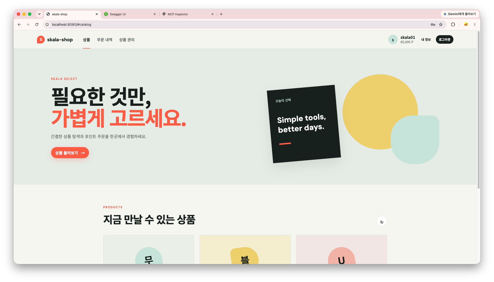
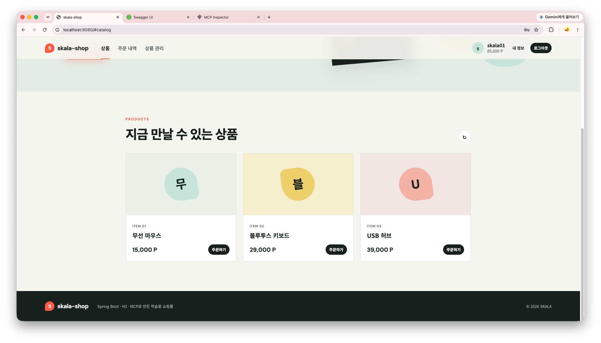
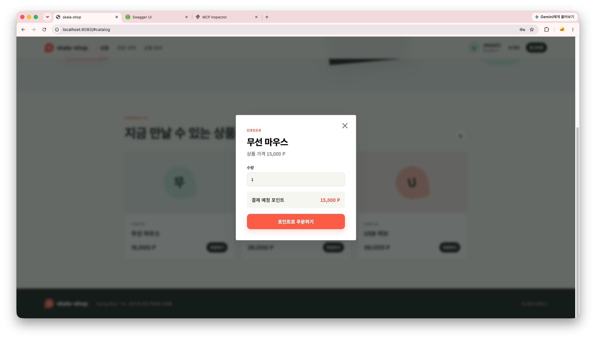
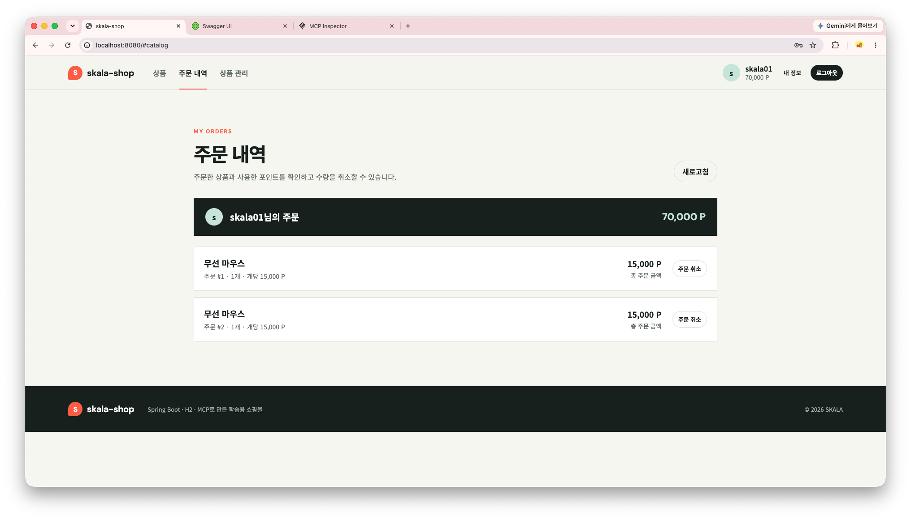
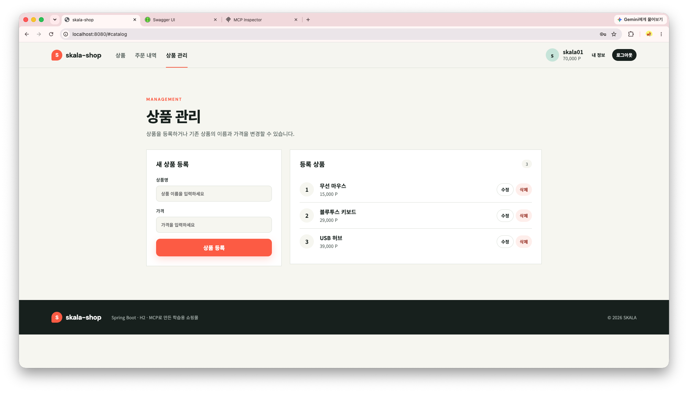
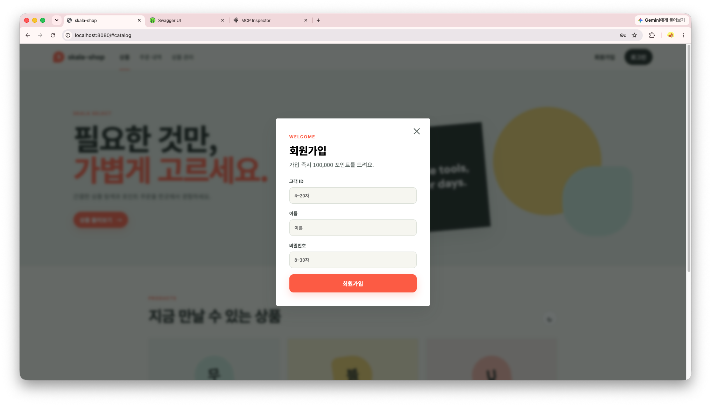
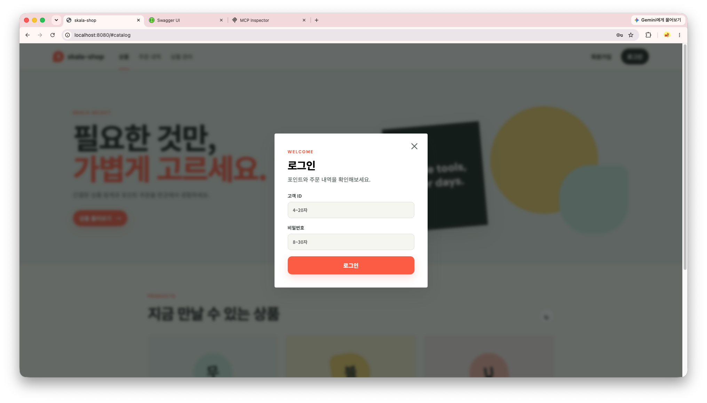
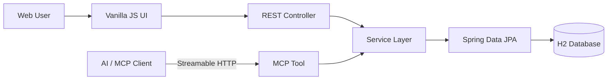
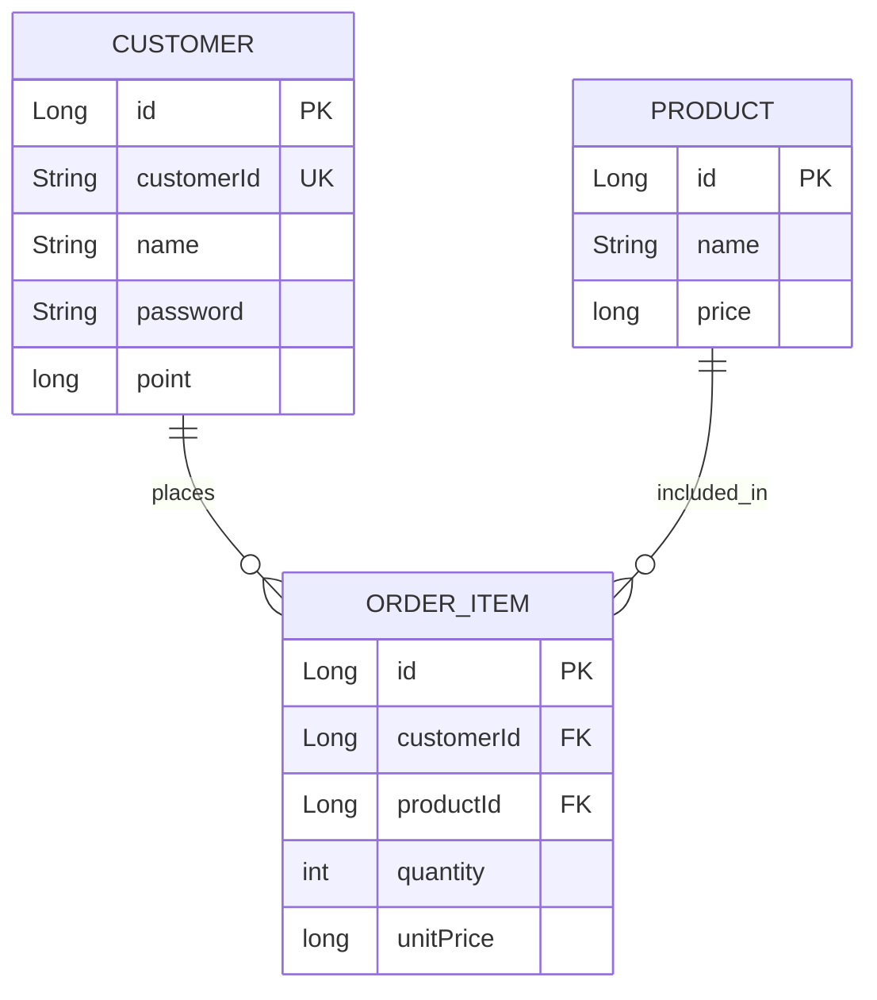

# skala-shop

> 포인트 기반 주문 도메인을 REST API와 MCP Tool로 제공하는 풀스택 쇼핑몰


`skala-shop`은 고객이 가입 시 지급받은 포인트로 상품을 주문하고, 주문 취소 시 포인트를 환불받는 학습용 쇼핑몰입니다. Spring Boot 기반 REST API 위에 반응형 웹 UI를 구현했으며, 동일한 Service 로직을 MCP Tool로도 노출해 AI 클라이언트가 상품과 고객 정보를 조회할 수 있도록 구성했습니다.



## 프로젝트 핵심

| 구분 | 구현 내용 |
| --- | --- |
| Backend | 상품·고객 CRUD, 로그인, 포인트 주문 및 취소, 페이지 조회 |
| Frontend | 상품 탐색, 회원가입·로그인, 주문, 주문 내역, 상품 관리 UI |
| MCP | Streamable HTTP 기반 MCP 서버와 조회 Tool 4종 제공 |
| Data | Spring Data JPA와 H2 인메모리 DB, 초기 상품 데이터 구성 |
| Reliability | Bean Validation, 업무 예외 분리, 일관된 오류 응답, 트랜잭션 처리 |

## 실행 화면

### 상품 탐색과 주문

상품 목록을 조회하고 로그인한 고객이 보유 포인트로 원하는 수량을 주문할 수 있습니다.

| 상품 목록 | 주문 |
| --- | --- |
|  |  |

### 주문 내역과 상품 관리

고객은 주문별 가격과 수량을 확인하고 전체 또는 일부 수량을 취소할 수 있습니다. 상품 관리 화면에서는 상품 등록·수정·삭제가 가능합니다.

| 주문 내역 | 상품 관리 |
| --- | --- |
|  |  |

<details>
<summary><strong>회원가입·로그인 화면 보기</strong></summary>

| 회원가입 | 로그인 |
| --- | --- |
|  |  |

</details>

## 주요 기능

### 고객

- 회원가입 시 `100,000` 포인트 지급
- 고객 ID와 비밀번호를 이용한 로그인
- 고객 목록 및 ID·이름 기반 단건 조회
- 이름과 보유 포인트 수정
- 고객 삭제 시 해당 고객의 주문 내역 함께 삭제

### 상품

- 전체 상품 및 단일 상품 조회
- 상품명과 가격을 이용한 상품 등록
- 상품 정보 수정 및 삭제
- 애플리케이션 시작 시 기본 상품 3종 자동 생성

### 주문

- `상품 단가 × 수량`을 계산하여 고객 포인트 차감
- 주문 당시 상품 단가를 주문 항목에 저장
- 고객별 주문 상품 및 총 주문 금액 조회
- 가장 최근의 동일 상품 주문부터 전체·부분 취소
- 주문 당시 단가를 기준으로 취소 금액 환불
- 잔여 수량이 0인 주문 항목 자동 삭제

### MCP

- Spring AI MCP Server Starter 기반 Streamable HTTP 서버
- 기존 Service 계층을 재사용하는 MCP Tool 구성
- MCP Inspector 등 외부 MCP Client에서 Tool 검색 및 호출
- REST API와 MCP가 동일한 비즈니스 규칙과 데이터 사용

## 기술 스택

### Backend

- Java 21
- Spring Boot 4.1.0
- Spring Web MVC
- Spring Data JPA
- Jakarta Bean Validation
- H2 Database
- Springdoc OpenAPI
- Gradle

### MCP

- Spring AI 2.0.1
- Spring AI MCP Server WebMVC Starter
- Streamable HTTP
- Annotation-based MCP Tools

### Frontend

- HTML5
- CSS3
- Vanilla JavaScript
- Fetch API
- Responsive Web Design

## 시스템 구조



웹 사용자는 REST API를 통해 기능을 사용하고, AI 클라이언트는 `/mcp`에 연결해 Tool을 호출합니다. 두 진입점 모두 동일한 Service를 사용하므로 주문과 포인트 정책이 한곳에서 유지됩니다.

## 설계 포인트

### 1. REST와 MCP의 비즈니스 로직 공유

MCP Tool에서 Repository를 직접 호출하지 않고 기존 `ProductService`, `CustomerService`를 사용했습니다. 새로운 인터페이스를 추가하면서도 도메인 로직 중복 없이 REST와 MCP의 동작을 일치시켰습니다.

```text
REST Controller ─┐
                 ├─ Service → Repository → Database
MCP Tool ────────┘
```

### 2. 트랜잭션 기반 포인트 정합성

주문 생성과 포인트 차감, 주문 취소와 포인트 환불을 각각 하나의 쓰기 트랜잭션으로 처리합니다. 포인트 부족, 취소 수량 초과 등의 업무 규칙을 확인한 후에만 상태를 변경합니다.

### 3. 주문 당시 가격 보존

상품 가격이 변경되더라도 정확한 주문 금액과 환불액을 계산할 수 있도록 `OrderItem.unitPrice`에 주문 당시 단가를 저장합니다.

### 4. 예측 가능한 오류 응답

업무 예외를 `BusinessException`과 `ErrorCode`로 분리하고 `GlobalExceptionHandler`에서 동일한 형식으로 변환합니다. 요청값 검증 오류도 필드별 사유를 정렬해 일관된 메시지를 제공합니다.

```json
{
  "timestamp": "2026-09-01T20:30:00",
  "status": 404,
  "code": "PRODUCT_NOT_FOUND",
  "message": "상품을 찾을 수 없습니다.",
  "path": "/api/products/999"
}
```

## 데이터 모델



## 프로젝트 구조

```text
src
├── main
│   ├── java/com/skala/skala_shop_api
│   │   ├── controller     # REST API 진입점
│   │   ├── domain         # Entity와 Repository
│   │   │   ├── customer
│   │   │   ├── order
│   │   │   └── product
│   │   ├── dto            # 요청·응답 모델
│   │   ├── exception      # 업무 예외와 전역 예외 처리
│   │   ├── service        # 상품·고객·주문 비즈니스 로직
│   │   └── tools          # Spring AI MCP Tool
│   └── resources
│       ├── static         # HTML, CSS, JavaScript UI
│       ├── application.yml
│       └── data.sql       # 초기 상품 데이터
└── test
    └── java               # Spring Context 테스트
```

## 시작하기

### 요구 사항

- JDK 21

Gradle Wrapper가 포함되어 있어 Gradle을 별도로 설치할 필요가 없습니다.

### 실행

macOS/Linux:

```bash
./gradlew bootRun
```

Windows:

```bat
gradlew.bat bootRun
```

서버가 시작되면 브라우저에서 아래 주소로 접속합니다.

| 서비스 | URL |
| --- | --- |
| 쇼핑몰 UI | http://localhost:8080 |
| Swagger UI | http://localhost:8080/swagger-ui/index.html |
| H2 Console | http://localhost:8080/h2-console |
| OpenAPI JSON | http://localhost:8080/v3/api-docs |
| MCP Endpoint | http://localhost:8080/mcp |

### 테스트와 빌드

```bash
./gradlew test
./gradlew clean build
```

빌드된 JAR 실행:

```bash
java -jar build/libs/skala-shop-api-0.0.1-SNAPSHOT.jar
```

## 사용 방법

1. http://localhost:8080 에 접속합니다.
2. 우측 상단의 `회원가입`을 선택합니다.
3. 고객 ID, 이름, 비밀번호를 입력하면 `100,000 P`가 지급됩니다.
4. 로그인 후 상품 카드에서 수량을 선택해 주문합니다.
5. `주문 내역`에서 주문 조회 및 취소를 수행합니다.
6. `상품 관리`에서 상품을 등록·수정·삭제할 수 있습니다.

> H2 인메모리 DB를 사용하므로 애플리케이션을 재시작하면 가입 정보와 주문 데이터가 초기화됩니다.

## 초기 데이터

| ID | 상품명 | 가격 |
| ---: | --- | ---: |
| 1 | 무선 마우스 | 15,000 P |
| 2 | 블루투스 키보드 | 29,000 P |
| 3 | USB 허브 | 39,000 P |

H2 Console 접속 정보:

```text
JDBC URL: jdbc:h2:mem:shopdb
User Name: sa
Password: (빈 값)
```

## REST API

### 상품

| Method | Endpoint | 설명 |
| --- | --- | --- |
| `GET` | `/api/products` | 전체 상품 조회 |
| `GET` | `/api/products/{id}` | 상품 단건 조회 |
| `POST` | `/api/products` | 상품 등록 |
| `PUT` | `/api/products/{id}` | 상품 수정 |
| `DELETE` | `/api/products/{id}` | 상품 삭제 |

### 고객과 주문

| Method | Endpoint | 설명 |
| --- | --- | --- |
| `GET` | `/api/customers?page=0&size=10` | 고객 목록 조회 |
| `GET` | `/api/customers/{customerId}` | 고객 ID 조회 |
| `GET` | `/api/customers/name/{customerName}` | 고객 이름 조회 |
| `GET` | `/api/customers/{customerId}/products` | 고객 주문 상품 조회 |
| `POST` | `/api/customers` | 회원가입 |
| `POST` | `/api/customers/login` | 로그인 |
| `PUT` | `/api/customers` | 고객 정보 수정 |
| `DELETE` | `/api/customers/{customerId}` | 고객 삭제 |
| `POST` | `/api/customers/order` | 상품 주문 |
| `POST` | `/api/customers/cancel` | 주문 취소 |

## MCP 사용

MCP 서버는 Spring Boot와 함께 실행되며 Streamable HTTP 방식으로 연결합니다.

```text
Transport: Streamable HTTP
URL: http://localhost:8080/mcp
```

제공 Tool:

| Tool | 설명 | Service 연결 |
| --- | --- | --- |
| `list_products` | 전체 상품 조회 | `ProductService.findAll()` |
| `get_product` | 상품 ID 단건 조회 | `ProductService.findById()` |
| `get_customer` | 고객과 주문 내역 조회 | `CustomerService.findByCustomerId()` |
| `list_customer_orders` | 고객별 주문 상품 조회 | `CustomerService.findProducts()` |

MCP Inspector에서 `Streamable HTTP` 서버를 추가하고 위 URL로 연결하면 Tool을 직접 조회하고 실행할 수 있습니다.

## 예외 코드

| HTTP | Code | 설명 |
| ---: | --- | --- |
| 400 | `INVALID_REQUEST` | 유효하지 않은 요청값 또는 JSON |
| 401 | `INVALID_CREDENTIALS` | 고객 ID 또는 비밀번호 불일치 |
| 404 | `PRODUCT_NOT_FOUND` | 존재하지 않는 상품 |
| 404 | `CUSTOMER_NOT_FOUND` | 존재하지 않는 고객 |
| 404 | `ORDER_NOT_FOUND` | 취소 가능한 주문 없음 |
| 409 | `DUPLICATE_CUSTOMER_ID` | 고객 ID 중복 |
| 409 | `INSUFFICIENT_FUNDS` | 보유 포인트 부족 |
| 409 | `INSUFFICIENT_QUANTITY` | 주문 수량보다 많은 취소 요청 |
| 500 | `INTERNAL_ERROR` | 처리되지 않은 서버 오류 |

## 개선 계획

- Spring Security와 비밀번호 해시 적용
- JWT 또는 세션 기반 사용자 인증·권한 분리
- 운영 DB 전환 및 Flyway 스키마 마이그레이션
- 상품 재고와 주문 상태 모델 추가
- 주문·취소 MCP Tool 확장 및 변경 작업 승인 정책 적용
- Service·Controller·MCP Tool 단위 및 통합 테스트 확대

## 참고 사항

이 프로젝트는 학습용으로 구현되었습니다. 현재 비밀번호는 암호화되지 않으며, 로그인 성공 시 인증 토큰을 발급하지 않습니다. 외부에 배포하기 전에 반드시 인증·인가와 MCP Endpoint 보안을 추가해야 합니다.
